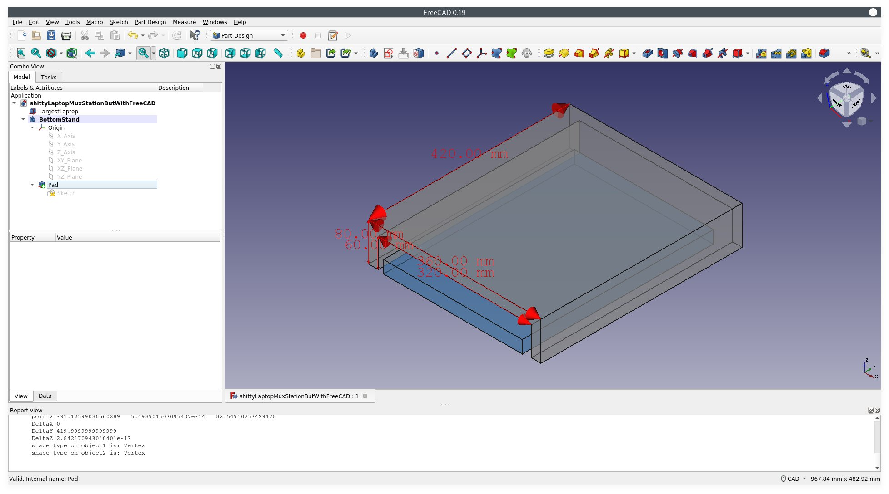

# Shitty Laptop MuxStation, but with FreeCAD

A way for me to stack laptops :D

## Materials

2x (60mm  x 420mm x 20mm ) wood - these are the sides
1x (420mm x 20mm  x 360mm) wood - this is the top

## Steps

just use a hammer and nails or some wood screws, lol

if u want more ports just uh. drill :D

## Screenshot

## notes

Largest laptop:

    Legion 5 17ACH6H

    https://psref.lenovo.com/syspool/Sys/PDF/Legion/Lenovo_Legion_5_17ACH6H/Lenovo_Legion_5_17ACH6H_Spec.pdf

    398.6 x 290 x 24.3-26.2 mm (15.7 x 11.41 x 0.96-1.03 inches)

    x = 398.6 mm
    y =  26.2 mm
    z = 290.0 mm